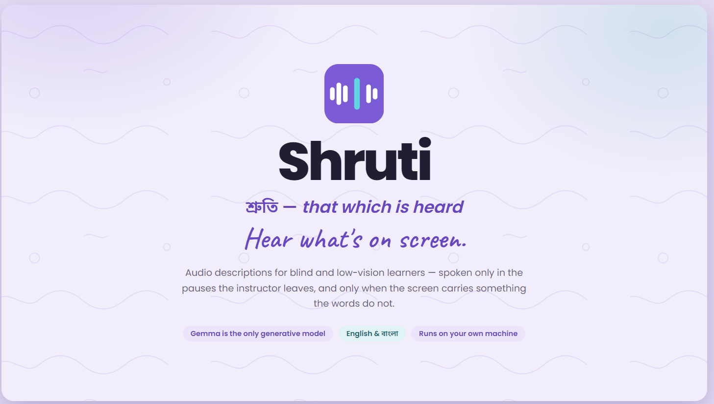
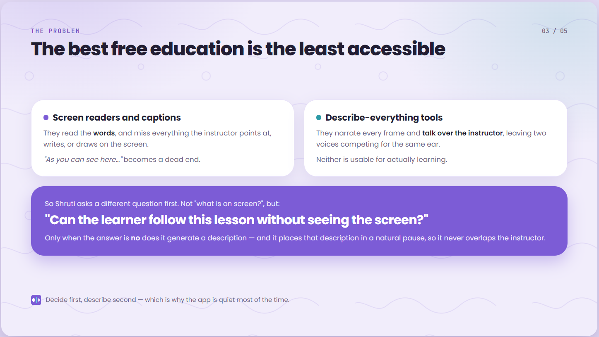
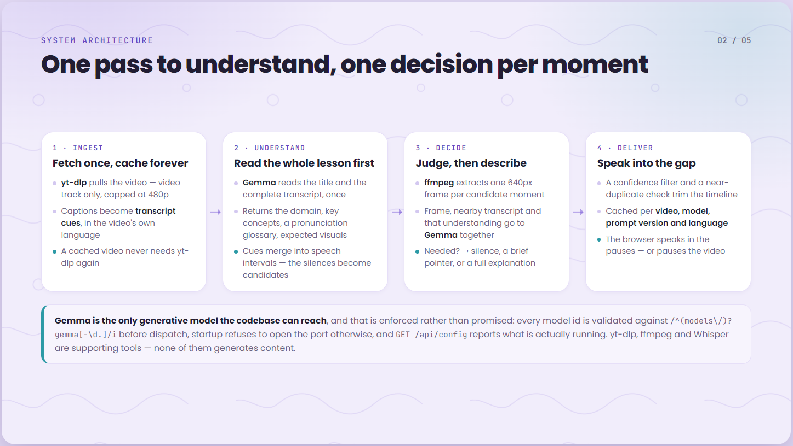
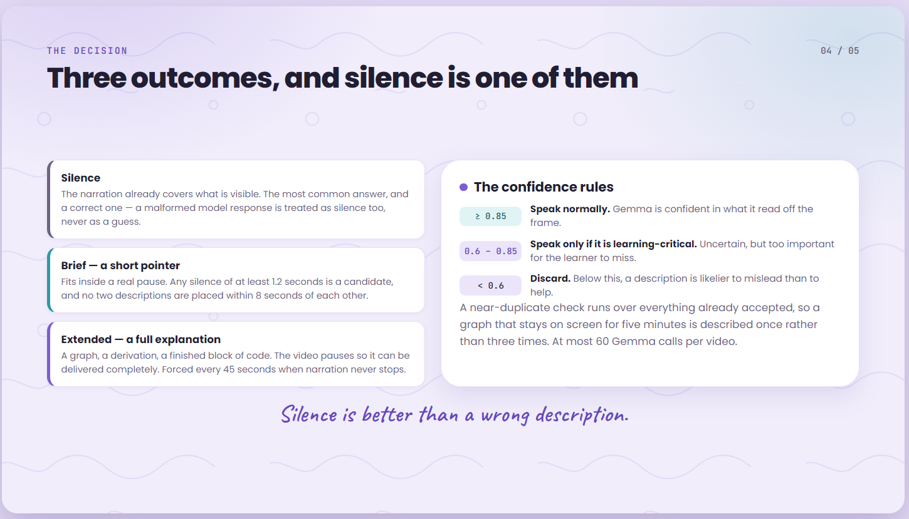
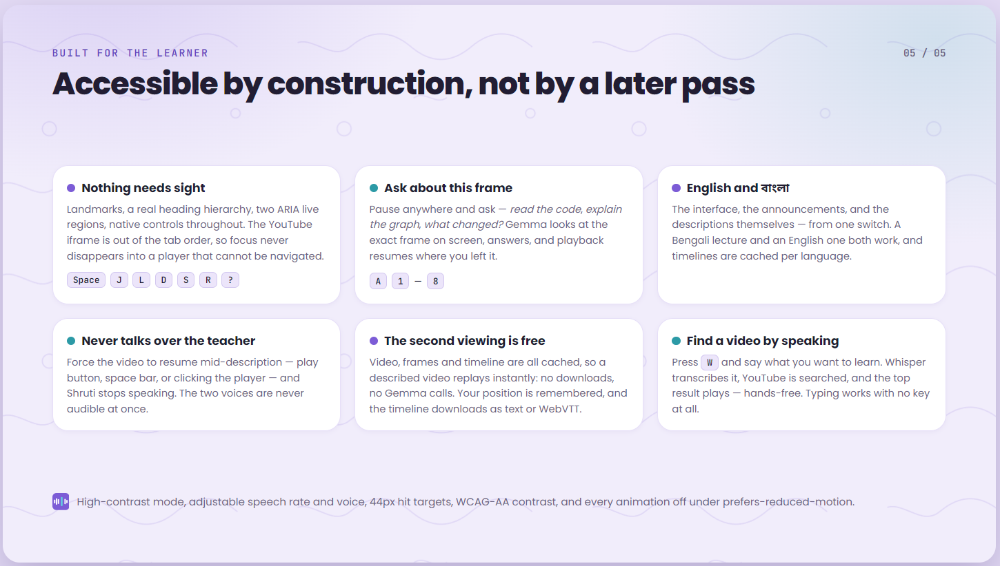

<p align="center">
  
</p>

<h1 align="center">Shruti</h1>

<p align="center"><strong>Hear what's on screen.</strong></p>

Shruti (শ্রুতি — *"that which is heard"*) lets blind and low‑vision learners follow a video without
missing what the screen shows. It reads the transcript, looks at the frames, decides **whether the
narration already covers what is visible**, and speaks a short description only when it does not —
in the natural pauses, never over the instructor.

The interface and the descriptions are available in **English and বাংলা**, switchable from one
control.



<!-- TODO(screenshot): landing screen — the URL form and the ready-to-play list.
     Save as docs/images/landing.png, then uncomment the line below. -->
<!--  -->

*Screenshot to add — the landing screen.*

---

## The problem

A huge amount of learning happens on YouTube — coding walkthroughs, maths lectures, data tutorials.
Almost all of it is **deeply visual**: code on screen, a diagram, a graph, a terminal, a formula.
For a blind or low‑vision learner, the existing options both fail:

- **Screen readers and captions** read the *words*, and miss everything the instructor points at,
  writes, or draws. "As you can see here…" becomes a dead end.
- **Describe‑everything tools** narrate every frame and **talk over the instructor**, turning a
  lesson into noise.

Neither is usable for actually *learning*. The result is that visual tutorials — some of the best
free education available — are effectively closed to millions of learners.



## What Shruti does

Shruti asks a different question first. Instead of *"What is on screen?"* the model is asked:

> **"Can the learner follow this lesson without seeing the screen?"**

Only when the answer is *no* does it generate a description, and it places that description **in a
natural pause** so it never overlaps the instructor. This **decide‑first, describe‑second** workflow
is the core of the project, and it is why the app is quiet most of the time.

The design rule behind everything: **silence is better than a wrong description.**

---

## Key features

- **Decide‑first descriptions.** Every candidate moment is a *decision* before it is a description.
  Most of the time the answer is silence.
- **Brief vs. full explanations.** A short pointer fits inside a pause; a complex visual — a graph, a
  derivation, a finished block of code — earns a full **Extended Audio Description** that pauses the
  video so it can be delivered completely.
- **Interactive assistant.** Pause any time and ask about the exact frame on screen — *"read the
  code", "explain this formula", "what changed?"* — by keyboard or free text.
- **Find a video by voice.** Press **W** and *speak* a search; Whisper transcribes it, YouTube is
  searched, and the top result plays — hands‑free. Or type, or paste a link.
- **English and বাংলা.** The whole interface — menus, controls, screen‑reader announcements — plus
  the descriptions and answers themselves, switchable from one control. See
  [Languages & voices](#languages--voices).
- **Picks up where you left off.** The position in each video is remembered locally and offered
  back on the next visit — announced, with the key that undoes it, rather than silently applied.
- **Take the descriptions with you.** Download a prepared timeline as plain text for revision, or
  as a WebVTT description track any player can load. Generated in the browser, so it costs nothing.
- **Accessible by construction.** Full keyboard control, screen‑reader announcements, WCAG‑AA
  contrast, a high‑contrast mode, and native controls throughout.
- **Runs on your own machine.** Gemma is open‑weight, so the same model that runs hosted can run
  locally with no key and no network.

<!-- TODO(screenshot): the player with its transport controls and the description list.
     Save as docs/images/player.png, then uncomment the line below. -->
<!--  -->

*Screenshot to add — the player and the prepared description list.*

---

## How it works



The same pipeline in full detail:

```
YouTube URL / spoken search
        │
        ▼
yt-dlp ──► video (cached)          yt-dlp ──► captions ──► transcript cues (with language)
        │                                                        │
        │                        ┌────────────────────────────────┤
        │                        ▼                                ▼
        │            GEMMA reads title + whole transcript    speech intervals
        │                   (comprehension pass)                  ▼
        │            understanding: domain, concepts,       natural pauses (gaps)
        │            glossary, expected visuals                   │
        │                        │                         candidate timestamps
        │                        └───────────────┬─────────────────┘
        ▼                                        ▼
ffmpeg ─────────► frame (640px JPEG) ──┬── nearby transcript ── understanding
                                       ▼
                                    GEMMA  (decide, then describe)
                                       │
                       ┌───────────────┴───────────────┐
                needed:false                     needed:true
                       │                    ┌──────────┴──────────┐
                    silence            mode:"brief"          mode:"explain"
                                    short pointer,        full explanation,
                                    fits a pause          pauses the video
                                            └──────────┬──────────┘
                                              confidence filter
                                                      │
                                              cached timeline
                                                      │
                                                      ▼
                                  browser scheduler speaks in the gaps
                                  (or pauses the video for an explanation)
```

**Understand the whole video first.** Before a single frame is judged, Gemma reads the title and the
complete transcript once and forms a compact understanding of the lesson: its **domain** (coding,
math, data, UI, science), the key concepts, a glossary of how to *say* tricky terms aloud
(`ReLU → "ray‑loo"`), and which visuals are likely to carry unspoken information. This understanding
rides along on every per‑frame decision, so descriptions use the lesson's own vocabulary. It is one
cheap text‑only call, cached per video.

**Where descriptions may happen.** Transcript cues become merged **speech intervals**; the complement
is the **silence**. Any silence of at least `MIN_GAP_SECONDS` is a candidate — Shruti can speak
there without ever overlapping the instructor. When narration runs for `FORCED_CANDIDATE_INTERVAL`
seconds with no usable pause, a candidate is added anyway and marked as one that must **pause the
video** (Extended AD).

**The confidence rules.** At or above `CONFIDENCE_HIGH` (0.85) → speak. Between `CONFIDENCE_CRITICAL`
and `HIGH` (0.6–0.85) → speak only when the content is genuinely learning‑critical. Below
`CONFIDENCE_CRITICAL` (0.6) → discard. A malformed model response is treated as "no description" —
never as a guess.

A near‑duplicate check runs over what has already been accepted, so a graph that stays on screen for
five minutes is described once rather than three times.



The invariants that hold all of this together are written down in
[`ARCHITECTURE.md`](ARCHITECTURE.md).

---

## Why Gemma

Gemma is **open‑weight**, which no other capable vision model is. That makes a genuinely free tier
possible: the same model runs locally through Ollama — no API key, no cost, nothing leaving the
machine — or hosted through Google AI Studio when you want the larger one. In a university setting
where an API key is a real obstacle, that is the difference between usable and not.

It is currently the only generative model the codebase can reach, and that is enforced rather than
promised:

- `assertGemmaOnly()` in [`server/src/config.js`](server/src/config.js) validates every model id
  against `/^(models\/)?gemma[-\d.]/i`. Every request path calls it before dispatch.
- Startup refuses to open the port if the configured model is not a Gemma model, or if no
  vision‑capable Gemma is reachable. It never silently substitutes another model.
- `GET /api/config` reports the model actually in use, the models considered, and the policy.
- `server/tests/config.test.js` asserts that GPT, Claude, Gemini, Llama and Mistral ids are all
  rejected — including that `gemini` is not mistaken for `gemma`.

**Supporting technologies**, none of which is a generative model: yt‑dlp for search and download,
ffmpeg for frame extraction, and Whisper for speech‑to‑text in voice search.

```bash
curl http://localhost:5174/api/config
```

---

## Languages & voices

The interface ships in **English and বাংলা**, switchable from the header or the settings panel.
English is the default; nothing is guessed from the browser locale, because guessing wrong changes
the language a screen reader announces in.

**The switch covers descriptions too.** Reading the app in Bangla means Gemma writes and speaks its
descriptions and answers in Bangla, whatever language the video is taught in — captions are still
read in the video's own language, so a Bengali lecture and an English one both work. Timelines are
cached per language, so one server can hold an English and a Bangla version of the same video side
by side.

One caveat worth knowing: a timeline keeps the language it was generated in. Switching the interface
after a video is prepared changes everything on screen and every new **answer** immediately, but the
descriptions already prepared stay as they are — regenerating them means re‑processing the video.

<!-- TODO(screenshot): the app in Bangla, showing Bengali descriptions.
     Save as docs/images/bangla.png, then uncomment the line below. -->
<!--  -->

*Screenshot to add — the app running in Bangla.*

> [!IMPORTANT]
> **Microsoft Edge is required for spoken Bangla (and most other non‑English languages).**
> Descriptions are *generated* correctly in any language — that part works in any browser. But they
> are *spoken* with the browser's own voices, and **Edge is the only major browser that ships an
> online Bengali voice with no installation.** In Chrome, Firefox, or Safari, Bangla output will not
> be heard unless you first install a matching OS voice. This is a browser and OS limitation, not a
> limitation of Shruti.

| Setting | Default | What it does |
|---|---|---|
| `CAPTION_LANGS` | `auto` | Reads the video's own caption tracks (a Bengali tutorial gets Bengali captions). Or a comma list like `bn,en`. |
| `OUTPUT_LANG` | `en` | Fallback language for descriptions and answers when a request does not name one. The app always sends its interface language, so this only affects direct API calls. `auto` mirrors the narration; a code like `bn` forces one. |

### Adding another language

The interface needs a new dictionary; descriptions need nothing at all — Gemma is multilingual and
the prompt layer already forces an output language.

1. Copy [`client/src/i18n/en.js`](client/src/i18n/en.js) to your language's code and translate the
   values. `client/tests/i18n.test.js` will tell you if a key or a `{placeholder}` is missing.
2. Register it in [`client/src/i18n/index.jsx`](client/src/i18n/index.jsx) — add the dictionary and
   an entry in `UI_LANGUAGES`, labelled in its own language.
3. Add a font with coverage for the script to `client/index.html` and the `--font-body` stack, unless
   the existing faces already cover it.
4. **Check there is a voice.** In the browser console:
   ```js
   speechSynthesis.getVoices().filter(v => v.lang.startsWith('bn'))
   ```
   If that returns nothing, descriptions will be generated correctly and then not spoken. Microsoft
   Edge covers most languages online; otherwise install an OS voice — on Windows, *Settings → Time &
   language → Language & region → Add a language → (check Text‑to‑speech)* — and restart the browser.

When a language has no installed voice, Shruti says so rather than reading the text with a
mismatched one.

---

## Quick start

### 1. Prerequisites

| Requirement | Check | Install |
|---|---|---|
| Node.js 20+ | `node --version` | <https://nodejs.org> |
| yt‑dlp | `yt-dlp --version` | `pip install yt-dlp` |
| ffmpeg + ffprobe | `ffmpeg -version` | `winget install Gyan.FFmpeg` · `brew install ffmpeg` · `apt install ffmpeg` |
| Gemma API key | — | <https://aistudio.google.com/apikey> (free) |

The runtime stack is small and pinned: **server** — Express, CORS, dotenv; **client** — React and
Vite. No AI SDKs; Gemma and Whisper are called over plain HTTPS.

### 2. Configure

```bash
cp .env.example .env      # then add your key
```

```dotenv
GEMMA_API_KEY=your-key-here
```

Two Gemma 4 ids serve vision through the Gemini API:

| Model | Notes |
|---|---|
| `gemma-4-31b-it` | Dense 31B — most capable. The default. |
| `gemma-4-26b-a4b-it` | Mixture‑of‑experts, 4B active — faster and cheaper per frame. |

Set `GEMMA_MODEL=auto` to pick the newest vision‑capable Gemma your key can reach. Anything that is
not a Gemma model is refused at startup.

### 3. Verify

```bash
npm install
npm run doctor          # add --full to also test download + frame extraction
```

The doctor checks every assumption the project rests on: binaries, API key, a real Gemma vision call
against a synthetic image, YouTube metadata, and transcript extraction. **Do not continue until it
passes.**

### 4. Run

```bash
npm run dev             # API on :5174, UI on http://localhost:5175
```

Or build once and serve everything from the API:

```bash
npm run build && npm start      # http://localhost:5174
```

> [!IMPORTANT]
> **Testing a Bangla video? Open the app in Microsoft Edge.** Spoken descriptions use the browser's
> built‑in voices, and Edge is the only common browser that ships online voices for Bangla with
> nothing to install. English works in any browser.

---

## Finding a video

You don't need a URL. Press **W**, or the **Find a video** button, to open search:

- **Press W and speak** — Shruti records a short clip, transcribes it with **Whisper**, searches
  YouTube, and **plays the top result** automatically. Press W again to stop recording. Fully
  hands‑free.
- **Type a search** — pick from the results.
- **Paste a YouTube link** — it loads straight away.

Text search works with no extra setup, using yt‑dlp's built‑in search. **Spoken** search needs an
OpenAI key for Whisper:

```dotenv
OPENAI_API_KEY=sk-...
```

Add it to `.env` and **restart the server** — `.env` is read only at startup. Until then the
microphone button is hidden and the dialog offers typing instead. Whisper lives behind a single
`transcribe()` function ([`server/src/services/transcribe.js`](server/src/services/transcribe.js)),
so swapping to a local Whisper such as whisper.cpp is a one‑file change.

You can also deep‑link a video: `http://localhost:5175/?v=<id-or-url>`.

---

## Accessibility

Accessibility is part of the MVP, not a later pass. The whole application is operable with a keyboard
and a screen reader, and nothing requires sight.



- Skip link, landmark structure, and a heading hierarchy that matches the visual one.
- Two ARIA live regions: polite for progress and state, assertive for errors and answers.
- Every control is a native `button`, `input`, or `select` — no custom widgets to get wrong.
- The YouTube iframe is `aria-hidden` and keyboard‑disabled, so focus never falls into a player a
  blind user cannot navigate; everything meaningful is exposed by the surrounding controls.
- Visible focus (3px), 44px+ hit targets, WCAG‑AA contrast, and a high‑contrast mode.
- Adjustable speech rate, volume, and voice, all persisted; `prefers-reduced-motion` respected.
- **Never overlaps the narrator.** If the learner forces the video to resume mid‑description — play
  button, space bar, or clicking the player — Shruti stops speaking so the two voices never collide.

### Keyboard shortcuts

| Key | Action |
|---|---|
| `Space` / `K` | Play or pause |
| `←` / `→` | Back / forward 5 seconds |
| `J` / `L` | Back / forward 10 seconds |
| `Home` | Back to the start (and forget the saved position) |
| `-` / `=` | Slow the video down / speed it up |
| `M` | Mute the video |
| `T` | Say the current position |
| `D` | Audio descriptions on / off |
| `S` | Skip the current description |
| `R` | Replay the last description |
| `,` / `.` | Speak slower / faster |
| `A` | Jump to the question box |
| `1`–`8` | Ask a preset question |
| `W` | Search by voice — press to record, press again to search |
| `Escape` | Stop speaking |
| `?` | Keyboard shortcut help |

---

## API

| Method | Endpoint | Purpose |
|---|---|---|
| `GET` | `/health` | Liveness |
| `GET` | `/api/config` | The running model and the model policy |
| `GET` | `/api/config/diagnostics` | Binaries, cache usage, visible models |
| `GET` | `/api/video/info?url=` | Video metadata |
| `GET` | `/api/captions?url=` | Transcript, speech intervals, gaps, language |
| `GET` | `/api/video/candidates?url=` | Candidate timestamps (no Gemma calls) |
| `GET` | `/api/video/frame?url=&time=` | One extracted JPEG frame |
| `POST` | `/api/describe/batch` | Generate (or reuse) a full description timeline |
| `POST` | `/api/process` | Same, as a background job with progress |
| `GET` | `/api/process/:jobId` | Poll job progress |
| `POST` | `/api/describe/frame` | Interactive Q&A about one frame |
| `GET` | `/api/describe/presets` | The preset questions |
| `GET` | `/api/videos/ready` | Videos already processed on this server |
| `DELETE` | `/api/video/cache?url=` | Evict everything cached for a video — **development only**, registered solely when `ENABLE_CACHE_ADMIN` is set |
| `GET` | `/api/search?q=` | Search YouTube (yt‑dlp) |
| `GET` | `/api/voice-search/status` | Whether spoken search is configured |
| `POST` | `/api/voice-search` | Transcribe a spoken clip (Whisper), then search |

`POST /api/process` and `POST /api/describe/frame` accept an `outputLang` — `auto`, or a language
code — choosing the language descriptions and answers are written in.

Errors are always `{ "error": { "code", "message", "details" } }`, with messages written to be read
aloud.

---

## Configuration reference

Every value is optional except `GEMMA_API_KEY`. See [`.env.example`](.env.example).

| Variable | Default | Meaning |
|---|---|---|
| `GEMMA_API_KEY` | — | AI Studio key |
| `GEMMA_MODEL` | `gemma-4-31b-it` | Model id, or `auto` to resolve the best available at startup |
| `GEMMA_MODEL_PREFERENCES` | `gemma-4-31b-it`, `gemma-4-26b-a4b-it` | Ordered fallbacks |
| `GEMMA_CONCURRENCY` | `3` | Parallel Gemma calls |
| `MIN_GAP_SECONDS` | `1.2` | Shortest silence worth speaking into |
| `MIN_SPACING_SECONDS` | `8` | Minimum distance between descriptions |
| `FORCED_CANDIDATE_INTERVAL` | `45` | Extended‑AD interval when narration never pauses |
| `MAX_CANDIDATES` | `60` | Hard ceiling on Gemma calls per video |
| `CONFIDENCE_HIGH` | `0.85` | Speak‑normally threshold |
| `CONFIDENCE_CRITICAL` | `0.6` | Discard threshold |
| `FRAME_WIDTH` | `640` | Frame width sent to Gemma |
| `MAX_VIDEO_HEIGHT` | `480` | Download resolution cap |
| `CAPTION_LANGS` | `auto` | Caption languages to fetch |
| `OUTPUT_LANG` | `en` | Fallback language for descriptions and answers |
| `OPENAI_API_KEY` | — | Enables **spoken** search (Whisper). Text search works without it |
| `WHISPER_MODEL` | `whisper-1` | Transcription model for voice search |
| `SEARCH_MAX_RESULTS` | `6` | How many YouTube results a search returns |
| `YTDLP_PROXY` | — | Send every yt‑dlp request out through this proxy (`http://`, `socks5://`). The cure for datacenter bot‑checks — see [Running on a server](#running-on-a-server) |
| `YTDLP_COOKIES_PATH` | — | A `cookies.txt` for yt‑dlp. Rarely needed on a residential connection |
| `YTDLP_COOKIES_DIR` | — | A directory of `cookies.txt` files tried in rotation |
| `ENABLE_CACHE_ADMIN` | off | Registers `DELETE /api/video/cache`. Leave off anywhere reachable from the internet — the API has no authentication |

---

## Caching

Three layers, all under `.cache/`:

| Area | Contents | Keyed by |
|---|---|---|
| `videos/` | Downloaded video (video track only, ≤480p) | video id |
| `frames/` | Extracted JPEGs | video id + centisecond timestamp |
| `data/` | Metadata, transcripts, description timelines | video id, plus a hash of model, prompt version, language, and pipeline settings |

A second viewing costs zero downloads and zero Gemma calls. Changing the model, the prompt, the
output language, or a threshold produces a new timeline key, so stale results are never reused.

One consequence is worth stating plainly: **once a video is cached it never needs yt‑dlp again.**
Playback is the YouTube iframe — pixels stream from YouTube's CDN straight to the viewer — and
interactive Q&A extracts frames with ffmpeg from the file already on disk. yt‑dlp runs exactly once
per video, during first processing.

---

## Running on a server

YouTube treats a datacenter IP with far more suspicion than a residential one, so a cloud deployment
hits *"Sign in to confirm you're not a bot"* where a laptop sails through. The important part is
that **the bot‑check keys on the IP, not the session** — which is why a `cookies.txt` exported from a
perfectly healthy browser still rots within days on a server, and why rotating a pool of accounts
only spreads that decay across more accounts instead of ending it.

Measured on the same day, same yt‑dlp version, same videos:

| Egress | Cookies needed | Outcome |
|---|---|---|
| Laptop (residential) | none at all | zero failures |
| Cloud VM (datacenter) | required | bot‑checked; cookie dead in ~3 days |

Two complementary answers, both of which avoid cookies entirely:

- **Pre‑process the videos you control on a laptop** and copy the cache files to the server. Because
  a cached video is permanently independent of yt‑dlp, those videos then work unconditionally — see
  [`docs/LOCAL_PREPROCESSING.md`](docs/LOCAL_PREPROCESSING.md).
- **Give the server a residential exit** via `YTDLP_PROXY`, so arbitrary URLs work too. A reverse SSH
  tunnel turns any machine on a home connection into that exit for free — see
  [`docs/RESIDENTIAL_EGRESS.md`](docs/RESIDENTIAL_EGRESS.md). This costs almost nothing to run: only
  the one‑time download per video goes through it, never playback.

General server setup lives in [`docs/DEPLOYMENT.md`](docs/DEPLOYMENT.md).

---

## Testing

```bash
npm test                                        # server + client, no network or key needed
npm run test:server
npm run test:client
RUN_INTEGRATION=1 npm test --workspace server   # + the full YouTube -> Gemma -> timeline chain
```

**Server** — gap detection, candidate selection and spacing, timeline normalisation, confidence
filtering, duplicate suppression, JSON recovery from model output, cache behaviour, job lifecycle,
transcript parsing (json3 and WebVTT), URL parsing, prompt contracts, and configuration validation.

**Client** — dictionary parity between languages, placeholder consistency, and a check that no
string was left untranslated. Drift is otherwise invisible, because a missing key falls back to
English silently.

---

## Project layout

```
server/
  src/
    config.js            configuration + the model guard
    app.js  index.js     Express wiring and startup validation
    lib/                 cache, JSON recovery, concurrency, binary discovery, language helpers
    services/
      gemma.js           the only model client
      youtube.js         id parsing, metadata, download, subtitles
      transcript.js      json3 / WebVTT parsing, language, context windows
      gaps.js            speech intervals, gaps, candidate selection
      frames.js          ffmpeg frame extraction
      comprehension.js   understand-the-whole-video pass
      timeline.js        decide-then-describe orchestration + confidence rules
      library.js         videos already processed on this server
      search.js          YouTube search (yt-dlp)
      transcribe.js      speech-to-text for voice search (Whisper)
      jobs.js            background processing with progress
    prompts/describe.js  the decision and Q&A prompts
    routes/              meta, video, describe, search
  scripts/doctor.js      environment viability check
  tests/                 unit, HTTP, and opt-in integration tests
client/
  public/logo.svg        the mark, also the favicon
  src/
    i18n/                en + bn dictionaries, the provider, spoken durations
    hooks/               player, speech, scheduler, shortcuts, settings, announcer, voice search
    components/          form, player, questions, timeline, settings, search, dialogs, icons
  tests/                 dictionary parity
```

---

## Roadmap

- **Captionless videos** — generate a timed transcript with local ASR (whisper.cpp) so videos with
  no captions can still be processed. The `transcribe()` seam already makes this a contained change.
- **Local model backend** — Gemma through Ollama as the default engine, so the app runs with no API
  key and no network at all.
- **Server‑side speech** — synthesise descriptions on the server, so spoken output stops depending
  on the viewer's browser having a voice.
- **Shareable timelines** — *import* a downloaded timeline (export already ships), so a described
  video can be handed to another learner with zero recompute.
- **Multi‑frame reasoning** — sample a short window per moment so changes that unfold over several
  seconds are captured, not just single frames.

## Limitations

- A video with **no captions in any language** cannot be processed — gap detection depends on knowing
  when the instructor speaks, and that is what captions provide.
- **Spoken output depends entirely on the browser's voices.** Bangla and most non‑English languages
  need **Microsoft Edge**; other browsers will generate a correct description and then have nothing
  installed to speak it aloud.
- Live streams are rejected.
- Descriptions come from a single frame per moment, so a change that only makes sense across several
  seconds may be missed. Asking *"What changed?"* covers that case interactively.
- Processing is front‑loaded: a long video costs several minutes and a number of Gemma calls the
  first time, and nothing on every viewing after that.
- On a cloud host, a video **nobody has processed yet** still needs a live yt‑dlp call, which YouTube
  bot‑checks from a datacenter IP. Already‑cached videos are unaffected and keep working
  unconditionally; see [Running on a server](#running-on-a-server).

---

## Licence

MIT — see [LICENSE](LICENSE).
